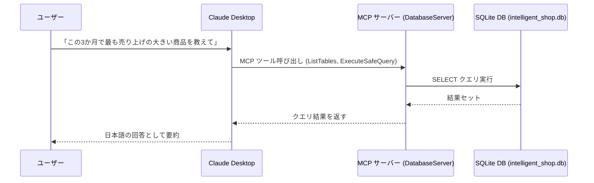

## はじめに

第3回目の本記事では、今回は、[『MCP入門――生成AIアプリ本格開発』（技術評論社）](https://www.amazon.co.jp/MCP%E5%85%A5%E9%96%80%E2%80%95%E2%80%95%E7%94%9F%E6%88%90AI%E3%82%A2%E3%83%97%E3%83%AA%E6%9C%AC%E6%A0%BC%E9%96%8B%E7%99%BA-%E5%B0%8F%E9%87%8E-%E5%93%B2-ebook/dp/B0FWBTVP6Q)の第6章に掲載されているプログラムを C# に移植します。(著者の小野哲さんからは、移植および掲載の許可をいただいています)

第6章のテーマは「MCP サーバーとデータベースの連携」です。MCP サーバー経由で SQLite データベースにアクセスできるようにすることで、SQL 文を直接書かなくても、生成 AI から自然言語で売上情報などを問い合わせられるようになります。

書籍では MCP サーバーを機能単位で段階的に拡張していきますが、本記事では最終形の `database_server.py` をまとめて C# に移植した形を紹介します。書籍を読みながら段階的に追っている方はもちろん、「最終的にどのような MCP サーバーになるのか」だけ知りたい方にも役立つ構成です。

:::message
『MCP入門―生成AIアプリ本格開発』を読んでいない方にも理解できる内容にしたつもりです。
:::

元となった Python コードは、以下のリポジトリで公開されています。

https://github.com/gamasenninn/MCP_Learning


**これまでの記事**

https://zenn.dev/zead/articles/mcp-learning-1

https://zenn.dev/zead/articles/mcp-learning-2

## サンプルデータベースを作成する

まずは、利用するサンプルデータベースを作成します。`create_sample_db.py`をC#コンソールアプリとして移植します。

1. プロジェクトを作成します。

```
dotnet new console -n CreateSampleDb
```

2. SQLiteのパッケージをインストールします。

```
dotnet add package Microsoft.Data.Sqlite
```

3. Program.cs を編集します。

customer, products, sales という3つのテーブルを作成し、データを挿入しています。

```cs
using Microsoft.Data.Sqlite;
using System.Globalization;

Console.OutputEncoding = System.Text.Encoding.UTF8;

CreateModernSampleDatabase();

static void CreateModernSampleDatabase()
{
    // AI が理解しやすいサンプルデータベースを作成
    var connectionString = new SqliteConnectionStringBuilder
    {
        DataSource = "intelligent_shop.db"
    }.ToString();

    using var connection = new SqliteConnection(connectionString);
    connection.Open();

    CreateTables(connection);
    InsertProducts(connection);
    InsertCustomers(connection);
    InsertSales(connection);

    Console.WriteLine("[完了] インテリジェント・ショップのデータベース作成完了: intelligent_shop.db");
    Console.WriteLine("[準備] AIが分析可能なリッチなデータが準備されました");
    Console.WriteLine("[データ] 3ヶ月分のビジネスデータ（100取引、10商品、5顧客）");
}

static void CreateTables(SqliteConnection connection)
{
    // テーブルを作成（存在しない場合のみ）
    using var command = connection.CreateCommand();

    // products テーブル（商品情報）
    command.CommandText = """
    CREATE TABLE IF NOT EXISTS products (
        id INTEGER PRIMARY KEY AUTOINCREMENT,
        name TEXT NOT NULL UNIQUE,
        price INTEGER NOT NULL CHECK(price > 0),
        stock INTEGER NOT NULL CHECK(stock >= 0),
        category TEXT NOT NULL,
        description TEXT,
        created_at TIMESTAMP DEFAULT CURRENT_TIMESTAMP,
        updated_at TIMESTAMP DEFAULT CURRENT_TIMESTAMP
    )
    """;
    command.ExecuteNonQuery();

    // sales テーブル（売上記録）
    command.CommandText = """
    CREATE TABLE IF NOT EXISTS sales (
        id INTEGER PRIMARY KEY AUTOINCREMENT,
        product_id INTEGER NOT NULL,
        quantity INTEGER NOT NULL CHECK(quantity > 0),
        unit_price INTEGER NOT NULL CHECK(unit_price > 0),
        total_amount INTEGER NOT NULL CHECK(total_amount > 0),
        sale_date DATE NOT NULL,
        customer_id INTEGER NOT NULL,
        sales_person TEXT,
        notes TEXT,
        FOREIGN KEY (product_id) REFERENCES products (id),
        FOREIGN KEY (customer_id) REFERENCES customers (id)
    )
    """;
    command.ExecuteNonQuery();

    // customers テーブル（顧客情報）
    command.CommandText = """
    CREATE TABLE IF NOT EXISTS customers (
        id INTEGER PRIMARY KEY AUTOINCREMENT,
        name TEXT NOT NULL,
        email TEXT UNIQUE,
        phone TEXT,
        address TEXT,
        customer_type TEXT CHECK(customer_type IN ('individual', 'business')),
        registration_date DATE DEFAULT (date('now')),
        total_purchases INTEGER DEFAULT 0,
        last_purchase_date DATE
    )
    """;
    command.ExecuteNonQuery();
}

static void InsertProducts(SqliteConnection connection)
{
    // 商品データを投入（存在しない場合のみ）
    using var transaction = connection.BeginTransaction();
    using var command = connection.CreateCommand();
    command.Transaction = transaction;

    command.CommandText = """
    INSERT OR IGNORE INTO products (name, price, stock, category, description)
    VALUES ($name, $price, $stock, $category, $description)
    """;

    var products = new (string Name, int Price, int Stock, string Category, string Description)[]
    {
        ("iPhone 15 Pro", 159800, 15, "スマートフォン", "A17 Proチップ搭載の最新iPhone"),
        ("MacBook Air M3", 134800, 8, "ノートPC", "13インチ、8GB RAM、256GB SSD"),
        ("iPad Pro 12.9", 128800, 12, "タブレット", "M2チップ搭載、12.9インチLiquid Retina XDRディスプレイ"),
        ("AirPods Pro 第3世代", 39800, 2, "オーディオ", "アクティブノイズキャンセリング搭載"),
        ("Apple Watch Series 9", 59800, 5, "ウェアラブル", "GPSモデル、45mm"),
        ("Magic Keyboard", 19800, 8, "アクセサリ", "iPad Pro用、バックライト付き"),
        ("iPhone 15", 124800, 25, "スマートフォン", "A16 Bionicチップ搭載"),
        ("iPad Air", 98800, 18, "タブレット", "M1チップ搭載、10.9インチ"),
        ("MacBook Pro 14インチ", 248800, 3, "ノートPC", "M3 Proチップ、16GB RAM、512GB SSD"),
        ("AirPods 第3世代", 19800, 30, "オーディオ", "空間オーディオ対応"),
    };

    foreach (var product in products)
    {
        command.Parameters.Clear();
        command.Parameters.AddWithValue("$name", product.Name);
        command.Parameters.AddWithValue("$price", product.Price);
        command.Parameters.AddWithValue("$stock", product.Stock);
        command.Parameters.AddWithValue("$category", product.Category);
        command.Parameters.AddWithValue("$description", product.Description);
        command.ExecuteNonQuery();
    }

    transaction.Commit();
}

static void InsertCustomers(SqliteConnection connection)
{
    // 顧客データを投入（存在しない場合のみ）
    using var transaction = connection.BeginTransaction();
    using var command = connection.CreateCommand();
    command.Transaction = transaction;

    command.CommandText = """
    INSERT OR IGNORE INTO customers (name, email, phone, address, customer_type)
    VALUES ($name, $email, $phone, $address, $customer_type)
    """;

    var customers = new (string Name, string Email, string Phone, string Address, string CustomerType)[]
    {
        ("田中太郎", "tanaka@example.com", "090-1234-5678", "東京都渋谷区", "individual"),
        ("佐藤商事株式会社", "sato@business.com", "03-1234-5678", "大阪府大阪市", "business"),
        ("山田花子", "yamada@example.com", "080-9876-5432", "愛知県名古屋市", "individual"),
        ("鈴木システム", "suzuki@tech.com", "045-111-2222", "神奈川県横浜市", "business"),
        ("高橋一郎", "takahashi@gmail.com", "070-5555-6666", "福岡県福岡市", "individual"),
    };

    foreach (var customer in customers)
    {
        command.Parameters.Clear();
        command.Parameters.AddWithValue("$name", customer.Name);
        command.Parameters.AddWithValue("$email", customer.Email);
        command.Parameters.AddWithValue("$phone", customer.Phone);
        command.Parameters.AddWithValue("$address", customer.Address);
        command.Parameters.AddWithValue("$customer_type", customer.CustomerType);
        command.ExecuteNonQuery();
    }

    transaction.Commit();
}

static void InsertSales(SqliteConnection connection)
{
    // ランダムな売上データを生成
    using var transaction = connection.BeginTransaction();

    var random = new Random();
    var salesPersons = new[] { "田中", "佐藤", "山田", "鈴木" };

    for (var i = 0; i < 100; i++)
    {
        var productId = random.Next(1, 11); // 1〜10
        var quantity = random.Next(1, 6);   // 1〜5

        // 商品の単価を取得
        using (var priceCommand = connection.CreateCommand())
        {
            priceCommand.Transaction = transaction;
            priceCommand.CommandText = "SELECT price FROM products WHERE id = $id";
            priceCommand.Parameters.AddWithValue("$id", productId);
            var unitPriceObj = priceCommand.ExecuteScalar();
            if (unitPriceObj is not long unitPriceLong)
            {
                // 万が一価格が取得できなかった場合はスキップ
                continue;
            }

            var unitPrice = (int)unitPriceLong;
            var totalAmount = unitPrice * quantity;

            // ランダムな日付（過去90日間）
            var daysAgo = random.Next(0, 91);
            var saleDate = DateTime.Now.Date.AddDays(-daysAgo);

            var customerId = random.Next(1, 6); // 1〜5
            var salesPerson = salesPersons[random.Next(salesPersons.Length)];

            using var insertCommand = connection.CreateCommand();
            insertCommand.Transaction = transaction;
            insertCommand.CommandText = """
            INSERT INTO sales
            (product_id, customer_id, quantity, unit_price, total_amount, sale_date, sales_person, notes)
            VALUES ($product_id, $customer_id, $quantity, $unit_price, $total_amount, $sale_date, $sales_person, $notes)
            """;

            insertCommand.Parameters.AddWithValue("$product_id", productId);
            insertCommand.Parameters.AddWithValue("$customer_id", customerId);
            insertCommand.Parameters.AddWithValue("$quantity", quantity);
            insertCommand.Parameters.AddWithValue("$unit_price", unitPrice);
            insertCommand.Parameters.AddWithValue("$total_amount", totalAmount);
            insertCommand.Parameters.AddWithValue("$sale_date", saleDate.ToString("yyyy-MM-dd", CultureInfo.InvariantCulture));
            insertCommand.Parameters.AddWithValue("$sales_person", salesPerson);
            insertCommand.Parameters.AddWithValue("$notes", DBNull.Value);

            insertCommand.ExecuteNonQuery();
        }
    }

    transaction.Commit();
}
```

4. ビルドします。

ビルドしてエラーがないか確認します。

```
dotnet build
```

5. 実行します。

```
dotnet run
```

`intelligent_shop.db`が作成されます。

以下、VS Code の SQLite Viewer 拡張機能で、データベースの中身を表示したスクリーンショットです。


## MCPサーバーの作成

では、このDBにアクセスするMCPサーバーを作成します。元となるソースは、`database_server.py`です。

### プロジェクトの作成

```
dotnet new mcpserver -n DatabaseServer
```

### SQLiteパッケージの追加

```
dotnet add package Microsoft.Data.Sqlite
```

### DTOクラスの定義

Toolsフォルダに`Dtos.cs`ファイルを作成し、以下の２つのDTOクラスを定義します。


```cs
/// <summary>
/// テーブル情報（名前と CREATE 文）を表す DTO。
/// </summary>
internal sealed class TableInfo
{
    /// <summary>テーブル名。</summary>
    public required string TableName { get; init; }
    /// <summary>テーブル作成時の CREATE 文。</summary>
    public required string CreationSql { get; init; }
}

/// <summary>
/// 実行したクエリの結果を表す DTO。
/// </summary>
internal sealed class QueryResult
{
    /// <summary>実行した SQL 文。</summary>
    public required string Sql { get; init; }

    /// <summary>結果行のリスト。各行はカラム名→値の辞書。</summary>
    public required IList<Dictionary<string, object?>> Results { get; init; }

    /// <summary>結果セットのカラム名一覧。</summary>
    public required IList<string> ColumnNames { get; init; }

    /// <summary>取得した行数。</summary>
    public int RowCount { get; init; }

    /// <summary>クエリ実行時刻。</summary>
    public DateTime ExecutedAt { get; init; }
}
```

### DatabaseTools.csの作成

Toolsフォルダに`DatabaseTools.cs`ファイルを作成します。

以下の２つのツールを定義しています。

**MCP ツール 1: DatabaseTools.ListTables()**

データベース内のすべてのテーブル名と CREATE 文を一覧表示します。
SQLite の sqlite_master を参照して、ユーザー定義テーブル（sqlite_% 以外）のテーブル名と CREATE 文を取得して、DTO TableInfo のリストとして返しています。
スキーマ確認・クエリ作成の前準備に使われます。
このツールは、「このデータベースにはどんなテーブルがありますか？」といった質問が来たときに呼び出され、テーブル名と CREATE 文をまとめて返します。AI はこの結果をもとに、どのテーブルをどう参照すればよいかを推論します。

**MCP ツール 2: DatabaseTools.ExecuteSafeQuery(string sql)**

SELECT 文のみを安全に実行します。受け取った SQL をまず ValidateSqlSafety() で検証し、安全な SELECT のみ実行します。
実行した SQL、結果行、カラム名一覧、行数、実行時刻を DTO QueryResult にまとめて返します。
このツールは、LLM が組み立てた SELECT 文を実行するために使います。ValidateSqlSafety によって破壊的な SQL を事前に弾いたうえで、SELECT クエリだけを実行し、その結果を JSON 化しやすい形に整えます。
SQLite のエラー (SqliteException) はメッセージをラップした InvalidOperationException としてスローし、クライアント側から原因を把握しやすくしています。

```cs
using System.ComponentModel;
using System.Text.RegularExpressions;
using System.Linq;
using Microsoft.Data.Sqlite;
using ModelContextProtocol.Server;

/// <summary>
/// SQLite データベース（intelligent_shop.db）に対する安全な参照系ツール群。
/// Python 版 database_server.py の C# / MCP 移植。
/// </summary>
internal sealed class DatabaseTools
{
    // データベース ファイル パス（実行ファイルのディレクトリ基準）
    private static readonly string DbPath =
        Path.Combine(AppContext.BaseDirectory, "intelligent_shop.db");

    /// <summary>
    /// SQLite データベースへの接続を生成します。
    /// 接続ごとに FOREIGN KEY 制約を有効化します。
    /// </summary>
    private static SqliteConnection GetConnection()
    {
        var connectionString = new SqliteConnectionStringBuilder
        {
            DataSource = DbPath,
        }.ToString();

        var connection = new SqliteConnection(connectionString);
        connection.Open();

        // 外部キー制約を有効化
        using (var pragma = connection.CreateCommand())
        {
            pragma.CommandText = "PRAGMA foreign_keys = ON";
            pragma.ExecuteNonQuery();
        }

        return connection;
    }

    /// <summary>
    /// SQL 文が安全かどうかを検証します。
    /// SELECT 文のみ許可し、破壊的なキーワードや典型的な攻撃パターンをブロックします。
    /// </summary>
    private static bool ValidateSqlSafety(string sql)
    {
        if (string.IsNullOrWhiteSpace(sql))
        {
            return false;
        }

        var normalized = sql.Trim();
        var upper = normalized.ToUpperInvariant();

        // 先頭は必ず SELECT から始まる必要がある
        if (!upper.StartsWith("SELECT", StringComparison.Ordinal))
        {
            return false;
        }

        // 禁止キーワード（破壊的操作系）
        string[] dangerousKeywords =
        [
            "DROP", "DELETE", "INSERT", "UPDATE", "ALTER",
            "CREATE", "TRUNCATE", "REPLACE", "PRAGMA",
            "ATTACH", "DETACH", "VACUUM",
        ];

        if (dangerousKeywords.Any(keyword => upper.Contains(keyword, StringComparison.Ordinal)))
        {
            return false;
        }

        // 危険なパターン（セミコロン以降の DDL/DML、コメント、UNION SELECT など）
        Regex[] dangerousPatterns =
        [
            new(@";\s*(DROP|DELETE|INSERT|UPDATE)", RegexOptions.IgnoreCase | RegexOptions.Compiled),
            new(@"--", RegexOptions.Compiled),
            new(@"/\*.*\*/", RegexOptions.Singleline | RegexOptions.Compiled),
            new(@"UNION\s+SELECT", RegexOptions.IgnoreCase | RegexOptions.Compiled),
        ];

        if (dangerousPatterns.Any(pattern => pattern.IsMatch(normalized)))
        {
            return false;
        }

        return true;
    }

    /// <summary>
    /// データベース内のすべてのテーブル名と CREATE 文を一覧表示します。
    /// テーブル構造の把握やクエリ作成の準備に使用します。
    /// </summary>
    [McpServerTool]
    [Description("データベース内の全テーブルと CREATE 文を一覧表示します。スキーマ確認・構造把握用。")]
    public IList<TableInfo> ListTables()
    {
        if (!File.Exists(DbPath))
        {
            throw new FileNotFoundException($"データベース ファイルが見つかりません: {DbPath}");
        }

        using var connection = GetConnection();
        using var command = connection.CreateCommand();
        command.CommandText = """
            SELECT name, sql
            FROM sqlite_master
            WHERE type = 'table' AND name NOT LIKE 'sqlite_%'
            ORDER BY name;
            """;

        using var reader = command.ExecuteReader();
        List<TableInfo> tables = [];

        while (reader.Read())
        {
            var name = reader.GetString(0);
            var createSql = reader.IsDBNull(1) ? string.Empty : reader.GetString(1);
            tables.Add(new TableInfo
            {
                TableName = name,
                CreationSql = createSql,
            });
        }

        return tables;
    }

    /// <summary>
    /// SELECT 文のみを安全に実行します。
    /// 破壊的な操作（INSERT/UPDATE/DELETE/DROP など）は禁止します。
    /// </summary>
    [McpServerTool]
    [Description("安全な SELECT クエリのみを実行し、結果を JSON 変換しやすい形式で返します。")]
    public QueryResult ExecuteSafeQuery(
        [Description("実行する SELECT 文。まず ListTables でスキーマを確認してから作成してください。")] string sql)
    {
        if (!ValidateSqlSafety(sql))
        {
            throw new ArgumentException("安全でない SQL 文です。SELECT 文のみ実行可能です。", nameof(sql));
        }

        if (!File.Exists(DbPath))
        {
            throw new FileNotFoundException($"データベース ファイルが見つかりません: {DbPath}");
        }

        try
        {
            using var connection = GetConnection();
            using var command = connection.CreateCommand();
            command.CommandText = sql;

            using var reader = command.ExecuteReader();
            List<Dictionary<string, object?>> results = [];
            var columnNames = Enumerable
                .Range(0, reader.FieldCount)
                .Select(reader.GetName)
                .ToList();

            while (reader.Read())
            {
                var row = new Dictionary<string, object?>(reader.FieldCount, StringComparer.OrdinalIgnoreCase);
                for (var i = 0; i < reader.FieldCount; i++)
                {
                    var value = reader.IsDBNull(i) ? null : reader.GetValue(i);
                    row[columnNames[i]] = value;
                }
                results.Add(row);
            }

            return new QueryResult
            {
                Sql = sql,
                Results = results,
                ColumnNames = columnNames,
                RowCount = results.Count,
                ExecutedAt = DateTime.Now,
            };
        }
        catch (SqliteException ex)
        {
            // Python 実装と同様に、SQL エラーはユーザー向けの例外メッセージとして返す
            throw new InvalidOperationException($"SQL エラー: {ex.Message}", ex);
        }
    }
}
```

### Program.csの編集

Program.csを以下のように変更します


```cs
using Microsoft.Extensions.DependencyInjection;
using Microsoft.Extensions.Hosting;
using Microsoft.Extensions.Logging;

var builder = Host.CreateApplicationBuilder(args);

builder.Logging.AddConsole(o => o.LogToStandardErrorThreshold = LogLevel.Trace);

builder.Services
    .AddMcpServer()
    .WithStdioServerTransport()
    .WithTools<DatabaseTools>();

await builder.Build().RunAsync();
```

### ビルドします

```
dotnet publish -c Release
```

`bin\Release\net10.0\win-x64\publish\`にexeファイルが作成されます。

## 動作を確認する

Claude Desktopに組み込んで動作を確認します。

### 実行ファイルとデータベースファイルをコピー

特定のフォルダに、以下のファイルをコピーします。ここでは、`C:\mcp-learning\mcpserver`フォルダにコピーすることとします。

1. DatabaseServer.exe
1. DatabaseServer.pdb
1. e_sqlite3.dll
1. intelligent_shop.db

### claude_desktop_config.jsonを編集

以下の例では、前回作成した、CalculatorServerも一緒に組み込んでいます。


```json
{
 "mcpServers": {
   "calculator": {
      "command": "C:\\mcp-learning\\mcpserver\\CalculatorServer.exe",
      "args": []
   },
   "database_server": {
      "command": "C:\\mcp-learning\\mcpserver\\DatabaseServer.exe",
      "args": []
   }
 }
}
```

### Claude Desktopで確認

Claude Desktopを起動して、以下のような質問を投げてみます。

#### テーブル一覧を取得

「このデータベースにはどんなテーブルがありますか？」


#### 売上状況を確認

「この3か月で最も売り上げの大きい商品を教えてください。」


### データの流れ（概要）

Claude Desktop、MCP サーバー、SQLite データベースの間のデータフローは、概ね次のようになります。



## 最後に

C# でデータベースと連携する MCP サーバーを実装しました。今回は MCP サーバーの安全性を確保するためにソースコードが少し長くなりましたが、やっていること自体はそれほど複雑ではありません。ぜひ AI の力も借りながら、ソースコードを読み解いてみてください。


次回は、第7章に掲載されている "OpenWeatherMap API と連携する MCP サーバー" を C# に移植してみようと思います。

---

本記事は、Qiita アドベントカレンダー「MCP Advent Calendar 2025」の23日目の記事です。
https://qiita.com/advent-calendar/2025/mcp
