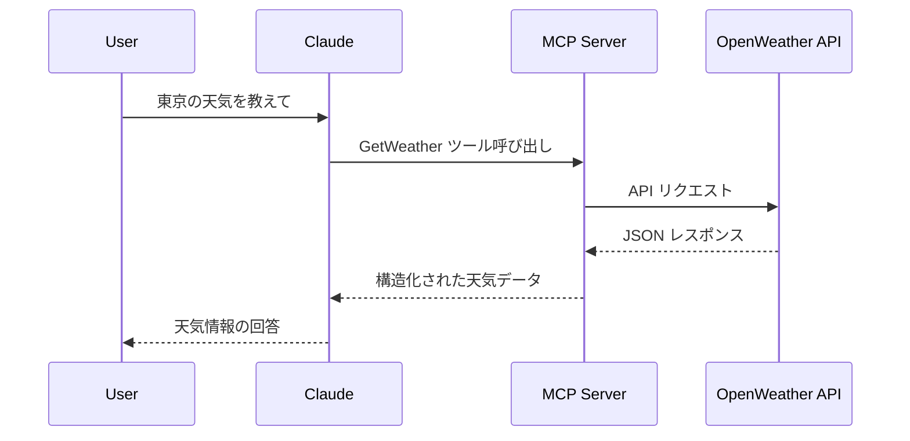

## はじめに

シリーズ第4回目の本記事では、[『MCP入門――生成AIアプリ本格開発』（技術評論社）](https://www.amazon.co.jp/MCP%E5%85%A5%E9%96%80%E2%80%95%E2%80%95%E7%94%9F%E6%88%90AI%E3%82%A2%E3%83%97%E3%83%AA%E6%9C%AC%E6%A0%BC%E9%96%8B%E7%99%BA-%E5%B0%8F%E9%87%8E-%E5%93%B2-ebook/dp/B0FWBTVP6Q)の第7章に掲載されているプログラム`external_api_server_weather.py`を C# に移植します。(著者の小野哲さんからは、移植および掲載の許可をいただいています)

:::message
『MCP入門―生成AIアプリ本格開発』を読んでいない方にも理解できる内容にしたつもりです。
:::


前回の記事では、データベースという「内部の情報」を扱いました。

https://zenn.dev/zead/articles/mcp-learning-3


今回は、外部の世界と繋がるMCPサーバーを C# でどのように書くかを見ていきます。
利用するWeb APIは、[OpenWeatherMap](https://openweathermap.org/) APIです。


元となった Python コードは、以下のリポジトリで公開されています。

https://github.com/gamasenninn/MCP_Learning


---

## 全体像

### 何をするサーバーか

このサーバーは、OpenWeatherMap の REST API を叩いて、指定した都市の
- 現在の天気
- 最大5日分の天気予報（3時間ごとの予報を日別にまとめたもの）

を取得し、その結果を **MCPツールの戻り値として JSONで返す** 役割を担います。C# 側は、次のような構成になっています。

- HTTP経由で MCPを提供するサーバー
    - エントリポイントは `Program.cs`
    - `.AddMcpServer().WithHttpTransport().WithTools<WeatherTools>()` で MCPを有効化
    - `/api/mcp` に MCPエンドポイントをマッピング
- OpenWeatherMap 連携の MCPツール群
    - WeatherToolsクラスに実装
    - 現在の天気: `WeatherTools.GetWeather()`
    - 天気予報: `WeatherTools.GetWeatherForecast()`
    
---

## OpenWeatherMap の API キーを用意する

事前に OpenWeatherMap のサイトから API キーを取得しておきます。

https://openweathermap.org/

サインアップ後に、APIキーを作成し、その値をメモしておいてください。

---

## プロジェクトの作成

以下のコマンドで、MCP サーバープロジェクトとして作成します。

```bash
dotnet new mcpserver -n WeatherServer
```

---


## DTOクラスの定義

まずは、MCP経由でJSONとして返却される公開DTOクラスを定義します。C#のレコード型を利用しています。
元のPythonのコードは型定義をしていませんが、C#の良さを出すために、できるだけ忠実にC#の型に移植しています。

Toolsフォルダに、Dtos.csファイルを作成し、Dtosクラスを定義します。

```cs
namespace WeatherServer.Tools;

/// <summary>
/// MCP 経由で JSON として返却される公開 DTO クラス。
/// </summary>
public static class Dtos
{
    /// <summary>
    /// 現在の天気情報のレスポンス。
    /// Python版 get_weather の戻り値に対応。
    /// </summary>
    public record CurrentWeatherResult(
        string City,
        string Country,
        double Temperature,
        double FeelsLike,
        double Humidity,
        double Pressure,
        string WeatherMain,
        string WeatherDescription,
        double WindSpeed,
        double Visibility, // km
        string Timestamp);

    /// <summary>
    /// 時刻別の予報データ。
    /// </summary>
    public record ForecastItem(
        string Time, // "HH:mm"
        double Temperature,
        string Weather,
        double RainProbability); // %

    /// <summary>
    /// 1日分の予報データ。
    /// </summary>
    public record DailyForecast(
        string Date, // ISO (yyyy-MM-dd)
        List<ForecastItem> Forecasts);

    /// <summary>
    /// 複数日分の天気予報レスポンス。
    /// Python版 get_weather_forecast の戻り値に対応。
    /// </summary>
    public record WeatherForecastResult(
        string City,
        string Country,
        List<DailyForecast> DailyForecasts);

    /// <summary>
    /// OpenWeather Current Weather API のレスポンス。
    /// </summary>
    public record CurrentWeatherResponse(
        string Name,
        Sys Sys,
        Main Main,
        Weather[] Weather,
        Wind? Wind,
        double? Visibility);

    /// <summary>
    /// OpenWeather Forecast API のレスポンス。
    /// </summary>
    public record ForecastResponse(
        City City,
        List<ForecastItemResponse> List);

    /// <summary>
    /// Forecast API の City 部分。
    /// </summary>
    public record City(
        string Name,
        string Country);

    /// <summary>
    /// Forecast API の List アイテム。
    /// </summary>
    public record ForecastItemResponse(
        long Dt,
        Main Main,
        Weather[] Weather,
        double? Pop);

    /// <summary>
    /// Main オブジェクト。
    /// </summary>
    public record Main(
        double Temp,
        double FeelsLike,
        double Humidity,
        double Pressure);

    /// <summary>
    /// Weather オブジェクト。
    /// </summary>
    public record Weather(
        string Main,
        string Description);

    /// <summary>
    /// Sys オブジェクト。
    /// </summary>
    public record Sys(
        string Country);

    /// <summary>
    /// Wind オブジェクト。
    /// </summary>
    public record Wind(
        double Speed);
}
```

## WeatherTools.csの作成

Toolsフォルダに、WeatherTools.csファイルを作成し、WeatherToolsクラスを定義します。
このクラスは、OpenWeatherMap API と連携して天気情報を取得するツールクラスです。

```csharp
using System.ComponentModel;
using System.Globalization;
using System.Text.Json;
using ModelContextProtocol.Server;

namespace WeatherServer.Tools;

/// <summary>
/// OpenWeather API と連携して天気情報を取得する MCP ツール群。
/// Python版 external_api_server_weather.py の移植版。
/// </summary>
public class WeatherTools
{
    // 共通で使用する HttpClient （タイムアウトを設定）
    private static readonly HttpClient HttpClient = new()
    {
        Timeout = TimeSpan.FromSeconds(10)
    };

    private const string CurrentWeatherUrl = "https://api.openweathermap.org/data/2.5/weather";
    private const string ForecastUrl = "https://api.openweathermap.org/data/2.5/forecast";

    /// <summary>
    /// OpenWeatherMap の API キーを環境変数から取得します。
    /// </summary>
    /// <returns>API キー文字列</returns>
    /// <exception cref="InvalidOperationException">API キー未設定の場合</exception>
    private static string GetOpenWeatherApiKey()
    {
        // Python版と同じく OPENWEATHER_API_KEY 環境変数を利用
        var apiKey = Environment.GetEnvironmentVariable("OPENWEATHER_API_KEY");

        if (string.IsNullOrWhiteSpace(apiKey))
        {
            throw new InvalidOperationException(
                "OpenWeatherMap APIキーが設定されていません (環境変数 OPENWEATHER_API_KEY を設定してください)。");
        }

        return apiKey;
    }

    /// <summary>
    /// 安全な API リクエスト実行（Python版 make_api_request 相当）。
    /// </summary>
    /// <typeparam name="T">デシリアライズする型</typeparam>
    /// <param name="baseUrl">ベースURL</param>
    /// <param name="queryParameters">クエリパラメーター</param>
    /// <returns>デシリアライズされたオブジェクト</returns>
    /// <exception cref="TimeoutException">タイムアウトの場合</exception>
    /// <exception cref="HttpRequestException">HTTPエラーの場合</exception>
    /// <exception cref="JsonException">JSONパースエラーの場合</exception>
    private async Task<T> MakeApiRequestAsync<T>(
        string baseUrl,
        IDictionary<string, string> queryParameters)
    {
        try
        {
            // クエリ文字列を組み立て
            var query = string.Join("&", queryParameters
                .Select(kvp => $"{Uri.EscapeDataString(kvp.Key)}={Uri.EscapeDataString(kvp.Value)}"));

            var uriBuilder = new UriBuilder(baseUrl) { Query = query };

            using var response = await HttpClient.GetAsync(uriBuilder.Uri).ConfigureAwait(false);
            response.EnsureSuccessStatusCode();

            var options = new JsonSerializerOptions { PropertyNameCaseInsensitive = true };
            return await JsonSerializer.DeserializeAsync<T>(
                response.Content.ReadAsStream(), options).ConfigureAwait(false)
                ?? throw new JsonException("デシリアライズ結果がnullです");
        }
        catch (TaskCanceledException ex) when (!ex.CancellationToken.IsCancellationRequested)
        {
            throw new TimeoutException("APIリクエストがタイムアウトしました", ex);
        }
        catch (HttpRequestException ex)
        {
            throw new HttpRequestException($"APIリクエストエラー: {ex.Message}", ex);
        }
        catch (JsonException ex)
        {
            throw new JsonException("APIレスポンスのJSONパースに失敗しました", ex);
        }
        catch (Exception ex)
        {
            throw new Exception($"ネットワークエラー: {ex.Message}", ex);
        }
    }

    // ==== MCP ツールメソッド ====

    [McpServerTool]
    [Description("指定した都市の現在の天気を取得します。OpenWeather の current weather API を利用し、気温・体感温度・湿度・気圧・天気概要・風速・視程などを返します。")]
    public async Task<Dtos.CurrentWeatherResult> GetWeather(
        [Description("都市名（例: Tokyo, Osaka）")] string city,
        [Description("国コード（例: JP, US）。省略時は JP。")] string countryCode = "JP")
    {
        var apiKey = GetOpenWeatherApiKey();
        var parameters = new Dictionary<string, string>
        {
            ["q"] = $"{city},{countryCode}",
            ["appid"] = apiKey,
            ["units"] = "metric", // 摂氏温度
            ["lang"] = "ja"       // 日本語
        };
        var response = await MakeApiRequestAsync<Dtos.CurrentWeatherResponse>(CurrentWeatherUrl, parameters).ConfigureAwait(false);

        return new Dtos.CurrentWeatherResult(
            City: response.Name,
            Country: response.Sys.Country,
            Temperature: response.Main.Temp,
            FeelsLike: response.Main.FeelsLike,
            Humidity: response.Main.Humidity,
            Pressure: response.Main.Pressure,
            WeatherMain: response.Weather.Length > 0 ? response.Weather[0].Main : string.Empty,
            WeatherDescription: response.Weather.Length > 0 ? response.Weather[0].Description : string.Empty,
            WindSpeed: response.Wind?.Speed ?? 0d,
            Visibility: response.Visibility.HasValue ? response.Visibility.Value / 1000.0 : 0d,
            Timestamp: DateTimeOffset.Now.ToString("o", CultureInfo.InvariantCulture));
    }

    [McpServerTool]
    [Description("指定した都市の天気予報（最大5日分）を取得します。3時間ごとの予報を日別にグループ化して返します。")]
    public async Task<Dtos.WeatherForecastResult> GetWeatherForecast(
        [Description("都市名（例: Tokyo, Osaka）")] string city,
        [Description("予報日数（1〜5日）。")] int days = 5,
        [Description("国コード（例: JP, US）。省略時は JP。")] string countryCode = "JP")
    {
        if (days < 1 || days > 5)
        {
            throw new ArgumentOutOfRangeException(nameof(days), "予報日数は1-5日の範囲で指定してください。");
        }

        var apiKey = GetOpenWeatherApiKey();
        var parameters = new Dictionary<string, string>
        {
            ["q"] = $"{city},{countryCode}",
            ["appid"] = apiKey,
            ["units"] = "metric",
            ["lang"] = "ja"
        };
        var response = await MakeApiRequestAsync<Dtos.ForecastResponse>(ForecastUrl, parameters).ConfigureAwait(false);

        var dailyForecasts = new List<Dtos.DailyForecast>();
        DateOnly? currentDate = null;
        Dtos.DailyForecast? currentDaily = null;

        // OpenWeather の 3時間刻みデータ：1日あたり最大8件を想定
        var maxItems = Math.Min(response.List.Count, days * 8);
        for (var i = 0; i < maxItems; i++)
        {
            var item = response.List[i];
            var dateTime = DateTimeOffset.FromUnixTimeSeconds(item.Dt).ToLocalTime().DateTime;
            var dateOnly = DateOnly.FromDateTime(dateTime);

            if (currentDate is null || currentDate.Value != dateOnly)
            {
                if (currentDaily is not null)
                {
                    dailyForecasts.Add(currentDaily);
                }
                currentDate = dateOnly;
                currentDaily = new Dtos.DailyForecast(
                    Date: dateOnly.ToString("yyyy-MM-dd", CultureInfo.InvariantCulture),
                    Forecasts: new List<Dtos.ForecastItem>());
            }

            currentDaily!.Forecasts.Add(new Dtos.ForecastItem(
                Time: dateTime.ToString("HH:mm", CultureInfo.InvariantCulture),
                Temperature: item.Main.Temp,
                Weather: item.Weather.Length > 0 ? item.Weather[0].Description : string.Empty,
                RainProbability: item.Pop.HasValue ? item.Pop.Value * 100.0 : 0d));
        }

        if (currentDaily is not null)
        {
            dailyForecasts.Add(currentDaily);
        }
        return new Dtos.WeatherForecastResult(
            City: response.City.Name,
            Country: response.City.Country,
            DailyForecasts: dailyForecasts.Take(days).ToList());
    }
}
```

WeatherTools クラスには以下のツールが実装されています：

- `GetWeather`: 指定した都市の現在の天気を取得
- `GetWeatherForecast`: 指定した都市の天気予報を取得

 `[McpServerTool]`属性、`[Description]`属性を使うのはこれまでと同じです。

これらのツールは OpenWeatherMap API を呼び出し、JSON レスポンスをパースして構造化されたデータを返します。型定義したりして書籍のコードより随分と長いコードになってしまいましたがご容赦を。

## エントリポイント: Program.cs

エントリポイントとなる `Program.cs`を編集し、WeatherToolsクラスをツールとして登録します。


```cs
using Microsoft.Extensions.DependencyInjection;
using Microsoft.Extensions.Hosting;
using Microsoft.Extensions.Logging;
using WeatherServer.Tools;

var builder = Host.CreateApplicationBuilder(args);

// すべてのログを stderr に送信するように設定します (MCP プロトコル メッセージには stdout が使用されます)。
builder.Logging.AddConsole(o => o.LogToStandardErrorThreshold = LogLevel.Trace);

// MCPサービスを追加します。使用するトランスポートは stdio です。
// ツールは、WeatherToolsクラスを利用します。
builder.Services
    .AddMcpServer()
    .WithStdioServerTransport()
    .WithTools<WeatherTools>();

var app = builder.Build();

await app.RunAsync();
```

## ビルドと実行

### ビルド

以下のコマンドでビルドします。

```
dotnet publish -c Release
```

`bin\Release\net10.0\win-x64\publish\`にexeファイルが作成されます。
この exe ファイルは、.NET Runtime がインストールされていない環境でも実行できます。

### 実行ファイルとデータベースファイルをコピー

特定のフォルダに以下のファイルをコピーします。ここでは、`C:\mcp-learning\mcpserver`フォルダにコピーすることとします。

1. WeatherServer.exe
1. WeatherServer.pdb

### claude_desktop_config.jsonを編集

Claude Desktopに組み込んで動作を確認します。
`%APPDATA%\Claude\claude_desktop_config.json` を開き、以下のように記述します（存在しない場合はファイルを作成してください）。

"OPENWEATHER_API_KEY"には、事前に取得したAPIキーを設定します。

```json
{
 "mcpServers": {
   "weather_server": {
      "command": "C:\\mcp-learning\\mcpserver\\WeatherServer.exe",
      "args": [],
      "env": {
        "OPENWEATHER_API_KEY": "ここにAPIキーを書く"
      }
   }
 }
}
```

:::message
Windows版のClaude Desktopは、OS側で設定した環境変数を正しく取得できないようです。そのため、claude_desktop_config.jsonに環境変数を記述しています。
:::

:::message alert
もし、うまく組み込めないようなら、タスクマネージャーからClaudeで検索して、タスクをすべて終了させてから、Claude Desktopを起動してください。
:::


### Claude Desktopで確認

Claude Desktopを起動して、以下のような質問を投げてみます。

「東京の天気を教えて」
「明日の宇都宮市の天気を教えて」

WeatherServer のツールが使用され、天気情報が返されます。


## データの流れ



## 最後に

この記事では、C#を使用して外部 APIと連携する MCPサーバーの作成方法について説明しました。
MCPツールが、何を受け取り何を返すべきなのかを見極めることができれば、あとは通常のWebAPIの呼び出しと変わりないことがわかりました。


次回は、第7章に掲載されている "NEWS APIと連携する MCPサーバー" を C#に移植してみようと思います。

---

**これまでの記事**

[C#でMCP入門（HTTP方式編）- 書籍『MCP入門』のPythonコードを移植する(1)](https://zenn.dev/zead/articles/mcp-learning-1)
[C#でMCP入門（STDIO方式編）- 書籍『MCP入門』のPythonコードを移植する(2)](https://zenn.dev/zead/articles/mcp-learning-2)
[C#でMCP入門（DB接続編）- 書籍『MCP入門』のPythonコードを移植する(3)](https://zenn.dev/zead/articles/mcp-learning-3)

