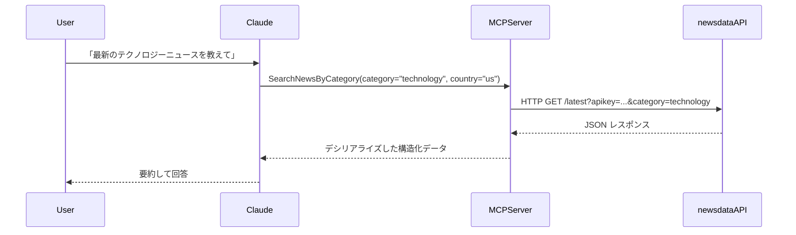

## はじめに

シリーズ第5回目の本記事では、[『MCP入門――生成AIアプリ本格開発』（技術評論社）](https://www.amazon.co.jp/MCP%E5%85%A5%E9%96%80%E2%80%95%E2%80%95%E7%94%9F%E6%88%90AI%E3%82%A2%E3%83%97%E3%83%AA%E6%9C%AC%E6%A0%BC%E9%96%8B%E7%99%BA-%E5%B0%8F%E9%87%8E-%E5%93%B2-ebook/dp/B0FWBTVP6Q)の第7章に掲載されているプログラム`newsapi_server.py`を C# に移植します。(著者の小野哲さんからは、移植および掲載の許可をいただいています)

:::message
『MCP入門―生成AIアプリ本格開発』を読んでいない方にも理解できる内容にしたつもりです。
:::


書籍『MCP入門』では、[NewsAPI](https://newsapi.org/)を利用して、ニュースを取得していましたが、本記事では、ニュース提供サービス [NewsData.io](https://newsdata.io/) を使って最新ニュース取得やキーワード検索を行う MCP サーバー（NewsServer）を C# で実装します。
NewsAPIでは、日本のニュースを取得できないようなので、日本のニュースを取得できるNewsData.ioを利用することにしました。

---

## 何をするMCPサーバーか（概要）

今回作成する NewsServer の役割は、外部のニュースAPI（NewsData.io）を呼び出して得られた JSON を MCPツールの戻り値としてそのまま返すことです。MCP クライアント（例: Claude Desktop）は返却された構造化データを利用してユーザーに自然言語で応答します。

具体的には次のツールを提供します：

- SearchNewsByCategory: カテゴリ／国ごとの最新ニュース取得
- SearchNewsByKeyword: キーワード検索によるニュース取得

:::message
書籍『MCP入門』では、get_latest_news、search_newsというメソッド名でしたが、SearchNewsByCategory、SearchNewsByKeywordと名前を変えています。メソッドの目的は変えていません。
:::


---

## NewsData.ioの の API キーを用意する

事前に NewsData.io のサイトから API キーを取得しておきます。

https://newsdata.io/

1. サイトにアクセスし、Loginリンクをクリックします。

2. Sign up here リンクをクリックします。

3. サインアップが完了するとダッシュボードページが表示されますので、左メニューのAPI Key項目をクリックします。

4. APIキーをメモしておきます。


---

## プロジェクトの作成

以下のコマンドで、MCP サーバープロジェクトとして作成します。

```bash
dotnet new mcpserver -n NewsServer
```

:::message
書籍『MCP入門』では、前回作成したWeatherServerに、NewsServerのツールを追加していますが、この記事では単独のNewsServer MCPサーバーを作成します。
:::


このプロジェクトでは、Microsoft.AspNetCore.WebUtilitiesパッケージを使いますので、インストールします。

```
dotnet add package Microsoft.AspNetCore.WebUtilities
```

:::message
前回の記事では、クエリ文字列を組み立てにUriBuilderクラスを利用しましたが、今回は、Microsoft.AspNetCore.WebUtilitiesパッケージに含まれるQueryHelpersクラスを使います。深い理由はありません。単にいろんなやり方があるよ、というのを示したかっただけです。
:::

---


## DTOクラスの定義

まずは、MCP経由でJSONとして返却される公開DTOクラスを定義します。C#のレコード型を利用しています。
元のPythonのコードは型定義をしていませんが、C#の良さを出すために、できるだけ忠実にC#の型に移植しています。

Toolsフォルダに、Dtos.csファイルを作成し、Dtosクラスを定義します。

```cs
using System.Text.Json;
using System.Text.Json.Serialization;

namespace NewsServer.Tools;

// newsdata.io の生レスポンスをそのまま扱うための DTO 群。
// SearchNewsByKeyword / SearchNewsByCategory は Dtos.ApiResponse を返します。
public static class Dtos {
    // API 内の source オブジェクト（{ id, name } の形）
    public record ApiSource(string? Id, string? Name);

    // API の articles / results に対応する型（API サンプルに合わせてプロパティを拡張）
    public record ApiArticle
    {
        public string? ArticleId { get; init; }

        public string? Link { get; init; }

        public string? Title { get; init; }

        public string? Description { get; init; }

        public string? Content { get; init; }

        public List<string>? Keywords { get; init; }

        // creator は文字列／配列／null が来るため JsonElement? のまま保持
        public JsonElement? Creator { get; init; }

        public string? Language { get; init; }

        public List<string>? Country { get; init; }

        public List<string>? Category { get; init; }

        public string? Datatype { get; init; }

        public string? PubDate { get; init; }

        public string? PubDateTZ { get; init; }

        public string? ImageUrl { get; init; }

        public string? VideoUrl { get; init; }

        public string? SourceId { get; init; }

        public string? SourceName { get; init; }

        public long? SourcePriority { get; init; }

        public string? SourceUrl { get; init; }

        public string? SourceIcon { get; init; }

        public string? Sentiment { get; init; }

        // 互換プロパティ
        public string? Url => Link;
    }

    // API レスポンス全体（newsdata.io の構造に合わせる）
    public record ApiResponse
    {
        public string? Status { get; init; }

        public List<ApiArticle>? Results { get; init; }

        public int? TotalResults { get; init; }

        // サンプルに nextPage が含まれているため追加
        public string? NextPage { get; init; }
    }
}
```

---


## NewsDataTools.csの作成

Toolsフォルダに、NewsDataTools.csファイルを作成し、NewsDataToolsクラスを定義します。
このクラスは、NewsData.io API と連携してニュースを取得するツールクラスです。

```cs
using System.ComponentModel;
using System.Text.Json;
using Microsoft.AspNetCore.WebUtilities;
using ModelContextProtocol.Server;

namespace NewsServer.Tools
{
    // newsdata.io を使ったニュース取得用の MCP ツール
    // NewsTools の機能と同等に、最新ニュース取得 (GetLatestNews) とキーワード検索 (SearchNews) を提供する。
    public class NewsDataTools
    {
        // HttpClient は static で再利用する（ソケット枯渇対策）
        private static readonly HttpClient httpClient = new ();

        // User-Agent を設定（APIプロバイダ向けの識別用）
        static NewsDataTools()
        {
            httpClient.DefaultRequestHeaders.UserAgent.ParseAdd("MCP-NewsServer-NewsData/1.0 (+https://www.zead.co.jp/contact/)");
        }

        // JsonSerializerOptions を使い回す
        private static readonly JsonSerializerOptions JsonOptions = new()
        {
            PropertyNameCaseInsensitive = false,
            PropertyNamingPolicy = JsonNamingPolicy.SnakeCaseLower
        };

        [McpServerTool]
        [Description("カテゴリと国でニュースを検索します")]
        public async Task<Dtos.ApiResponse> SearchNewsByCategory(
            [Description("カテゴリ（例: top, business, technology, sports, entertainment, science, health, finance）")] string category = "top",
            [Description("国コード（jp, us, uk など）")] string country = "us",
            [Description("取得件数（最大10）")] int limit = 5)
        {
            // 引数の正規化（内部では API の生レスポンスを返すため、必要なら呼び出し側で件数を制御してください）
            limit = Math.Clamp(limit, 1, 10);
    
            var queryParams = new Dictionary<string, string?> {
                ["apikey"] = GetApiKey(),
                ["country"] = country,
                ["category"] = category,
                ["size"] = limit.ToString()
                // newsdata.io はページングをサポートしますが、ここでは API の生レスポンスをそのまま返します
            };
    
            var url = BuildUrl("https://newsdata.io/api/1/latest", queryParams);
            var apiResp = await MakeApiRequestAsync<Dtos.ApiResponse>(url);
    
            // 利用者側で結果数を扱えるよう、APIの生レスポンスをそのまま返す
            return apiResp;
        }

        [McpServerTool]
        [Description("キーワードでニュースを検索します")]
        public async Task<Dtos.ApiResponse> SearchNewsByKeyword(
            [Description("検索キーワード")] string query,
            [Description("言語コード（ja, en 等）")] string language = "en",
            [Description("取得件数（最大10）")] int limit = 5)
        {
            // 引数の正規化（内部では API の生レスポンスを返すため、必要なら呼び出し側で件数を制御してください）
            limit = Math.Clamp(limit, 1, 20);
    
            if (string.IsNullOrWhiteSpace(query))
                throw new ArgumentException("検索キーワードを指定してください", nameof(query));
    
            var queryParams = new Dictionary<string, string?> {
                ["apikey"] = GetApiKey(),
                ["q"] = query,
                ["language"] = language,
                ["size"] = limit.ToString()
                // 必要ならソート等のパラメータを追加可能
            };
    
            var url = BuildUrl("https://newsdata.io/api/1/latest", queryParams);
            var apiResp = await MakeApiRequestAsync<Dtos.ApiResponse>(url);
    
            // API の生レスポンスをそのまま返す
            return apiResp;
        }

        // QueryHelpers.AddQueryString を使って URL を作成するヘルパー
        private static string BuildUrl(string baseUrl, IDictionary<string, string?> parameters)
        {
            var filtered = parameters
                .Where(kv => !string.IsNullOrWhiteSpace(kv.Value))
                .ToDictionary(kv => kv.Key, kv => kv.Value);
            return QueryHelpers.AddQueryString(baseUrl, filtered);
        }

        // APIキー取得を共通化（環境変数のみを使用）
        private static string GetApiKey()
        {
            var apiKey = Environment.GetEnvironmentVariable("NEWSDATA_API_KEY");
            if (string.IsNullOrWhiteSpace(apiKey))
                throw new InvalidOperationException("newsdata.io の API キーが環境変数 NEWSDATA_API_KEY に設定されていません");
            return apiKey!;
        }

        // 非同期で API 呼び出しを行い、任意の型へデシリアライズする（デバッグ出力含む）
        private async Task<T> MakeApiRequestAsync<T>(string url)
        {
            // デバッグ用にリクエスト URL を出力（stderr）
            Console.Error.WriteLine($"DEBUG: Request URL: {url}");

            using var resp = await httpClient.GetAsync(url);
            resp.EnsureSuccessStatusCode();
            var body = await resp.Content.ReadAsStringAsync();
            return JsonSerializer.Deserialize<T>(body, JsonOptions)
                ?? throw new InvalidOperationException("JSON を指定した型にデシリアライズできませんでした。");
        }
    }
}
```

NewsDataTools クラスには以下のツールが実装されています：

- SearchNewsByCategory: カテゴリ／国ごとの最新ニュース取得
- SearchNewsByKeyword: キーワード検索によるニュース取得

 [McpServerTool]属性、[Description]属性を使うのはこれまでと同じです。

今回作成したメソッドは、API の生レスポンスをそのまま返しています。もしかしたら、返すデータを絞った方が良いかもしれません。そのほうが、LLMでの負荷が軽くなると思われます。

---


## エントリポイント: Program.cs

エントリポイントとなる `Program.cs`を編集し、NewsDataToolsクラスをツールとして登録します。毎回同じようなコードなので、重要な箇所だけ掲載します。


```cs
builder.Services
    .AddMcpServer()
    .WithStdioServerTransport()
    .WithTools<NewsDataTools>();
```

## ビルドと実行

### ビルド

以下のコマンドでビルドします。

```
dotnet publish -c Release
```

`bin\Release\net10.0\win-x64\publish\`にexeファイルが作成されます。
この exe ファイルは、対象プラットフォーム用の .NET Runtime がインストールされていない環境でも実行できます。

### 実行ファイルとデータベースファイルをコピー

特定のフォルダに以下のファイルをコピーします。ここでは、`C:\mcp-learning\mcpserver`フォルダにコピーすることとします。

1. NewsServer.exe
1. NewsServer.pdb

### claude_desktop_config.jsonを編集

Claude Desktopに組み込んで動作を確認します。
`%APPDATA%\Claude\claude_desktop_config.json` を開き、以下のように記述します。前回の記事で作成したWeatherServerも一緒に組み込んでいます。

OPENWEATHER_API_KEY、NEWSDATA_API_KEYには、事前に取得したAPIキーを設定します。

```json
{
 "mcpServers": {
    "weather_server": {
      "command": "C:\\mcp-learning\\mcpserver\\WeatherServer.exe",
      "args": [],
      "env": {
        "OPENWEATHER_API_KEY": "ここにAPIキーを書く"
      }
    },
    "news_server": {
      "command": "C:\\mcp-learning\\mcpserver\\NewsServer.exe",
      "args": [],
      "env": {
        "NEWSDATA_API_KEY": "ここにAPIキーを書く"
"
      }
    }
}
```

:::message
Windows版のClaude Desktopは、OS側で設定した環境変数を正しく取得できないため、claude_desktop_config.jsonに環境変数を記述します。
:::


:::message alert
もし、うまく組み込めないようなら、タスクマネージャーからClaudeで検索して、タスクをすべて終了させてから、Claude Desktopを起動してください。
:::


### Claude Desktopで確認

Claude Desktopを起動して、以下のような質問を投げてみます。

「最新のテクノロジーニュースを教えて」

「明日、シンガポールに行くので、シンガポールの天気とニュースを教えて」


## データフロー（概要）

ユーザー（質問） → Claude Desktop（LLM） → MCP Server（NewsServer） → NewsData.io API → MCP Server → Claude Desktop → ユーザー

概略図:



---


## 最後に

この記事では、C#を使用して外部 API と連携する MCPサーバーの作成方法について説明しました。
MCPツールが、何を受け取り何を返すべきなのかを見極めることができれば、あとは通常のWebAPIの呼び出しと変わりないことがわかりました。


次回は、第7章に掲載されている 位置情報API(IP-API)と連携する MCPサーバーを C#に移植してみようと思います。


---

**これまでの記事**

[C#でMCP入門（HTTP方式編）- 書籍『MCP入門』のPythonコードを移植する(1)](https://zenn.dev/zead/articles/mcp-learning-1)
[C#でMCP入門（STDIO方式編）- 書籍『MCP入門』のPythonコードを移植する(2)](https://zenn.dev/zead/articles/mcp-learning-2)
[C#でMCP入門（DB接続編）- 書籍『MCP入門』のPythonコードを移植する(3)](https://zenn.dev/zead/articles/mcp-learning-3)
[C#でMCP入門（Weather API連携編）- 書籍『MCP入門』のPythonコードを移植する(4)](https://zenn.dev/zead/articles/mcp-learning-4)

