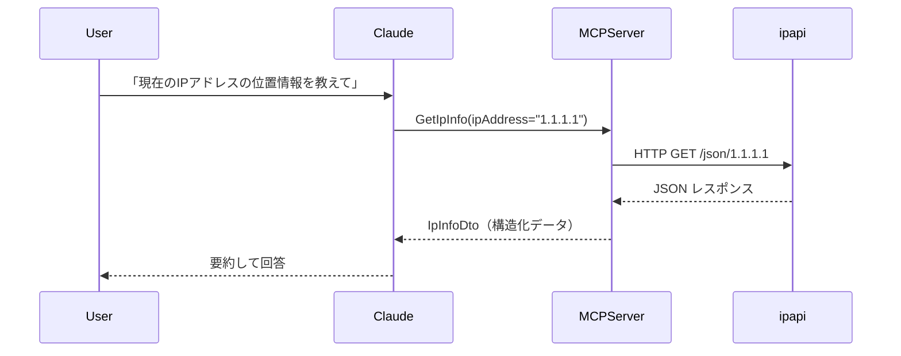

## はじめに

シリーズ第6回目の本記事では、[『MCP入門――生成AIアプリ本格開発』（技術評論社）](https://www.amazon.co.jp/MCP%E5%85%A5%E9%96%80%E2%80%95%E2%80%95%E7%94%9F%E6%88%90AI%E3%82%A2%E3%83%97%E3%83%AA%E6%9C%AC%E6%A0%BC%E9%96%8B%E7%99%BA-%E5%B0%8F%E9%87%8E-%E5%93%B2-ebook/dp/B0FWBTVP6Q)の第7章に掲載されているプログラム`external_api_server_ipinfo`を C# に移植します。(著者の小野哲さんからは、移植および掲載の許可をいただいています)

IPアドレスに関する情報を取得するAPIと連携させるMCPサーバーを作成します。

なお、今回利用する[ip-api](https://ip-api.com/)は、APIキー不要で利用できるAPIですが、非商用目的および非営利環境での利用に制限されています。利用する際は注意してください。


https://ip-api.com/docs/legal


:::message
『MCP入門―生成AIアプリ本格開発』を読んでいない方にも理解できる内容にしたつもりです。
:::

元となった Python コードは、以下のリポジトリで公開されています。

https://github.com/gamasenninn/MCP_Learning

---

## 1. プロジェクトを作る

まず、MCP サーバー用テンプレートからプロジェクトを作成します。ワークディレクトリで次のコマンドを実行してください。

[`cs.declaration()`](Chap07/IpInfoServer/IpInfoServer.csproj:1)
```bash
dotnet new mcpserver -n IpInfoServer
cd IpInfoServer
```

---

## 2. DTO 定義を作る（結果を受け取る型）

MCP ツールが返却するデータの型（DTO）を定義します。ip-api のレスポンス項目に合わせたプロパティを用意しています。プロジェクトの `Tools` フォルダを作成し、`Dtos.cs` を新規作成します。


```cs
using System;

public class IpInfoDto
{
    public string Ip { get; set; } = "";
    public string Country { get; set; } = "";
    public string CountryCode { get; set; } = "";
    public string Region { get; set; } = "";
    public string City { get; set; } = "";
    public string Zip { get; set; } = "";
    public double Latitude { get; set; }
    public double Longitude { get; set; }
    public string Timezone { get; set; } = "";
    public string Isp { get; set; } = "";
    public string Organization { get; set; } = "";
}
```

---

## 3. IpInfoTools の実装（外部 API 呼び出し）

次に、実際に ip-api.com に問い合わせるツールを実装します。`Tools/IpInfoTools.cs` を作成して以下のコードを入れてください。

```cs
using System;
using System.ComponentModel;
using System.Net.Http;
using System.Text.Json;
using System.Threading.Tasks;
using ModelContextProtocol.Server;

/// <summary>
/// IP情報取得のための MCP ツール群。
/// 外部 API (http://ip-api.com) に問い合わせを行い、IP 情報を返す。
/// </summary>
public class IpInfoTools
{
    // HttpClient は再利用するため static にしておく
    private static readonly HttpClient _httpClient = new HttpClient()
    {
        Timeout = TimeSpan.FromSeconds(10)
    };

    /// <summary>
    /// IPアドレスの情報を取得します（指定なしで自身のIPを取得）。
    /// </summary>
    /// <param name="ipAddress">調べたいIPアドレス（省略可）</param>
    /// <returns>IP情報DTO</returns>
    [McpServerTool]
    [Description("IPアドレスの情報を取得します（調べたいIPアドレスを指定、未指定で自分のIP）")]
    public async Task<IpInfoDto> GetIpInfo([Description("調べたいIPアドレス（省略可）")] string ipAddress = null)
    {
        var url = string.IsNullOrWhiteSpace(ipAddress)
            ? "http://ip-api.com/json/"
            : $"http://ip-api.com/json/{ipAddress}";

        try
        {
            var response = await _httpClient.GetAsync(url);
            response.EnsureSuccessStatusCode();

            using var stream = await response.Content.ReadAsStreamAsync();
            using var doc = JsonDocument.Parse(stream);
            var root = doc.RootElement;

            var status = root.GetProperty("status").GetString();
            if (string.Equals(status, "fail", StringComparison.OrdinalIgnoreCase))
            {
                var msg = root.TryGetProperty("message", out var m) ? m.GetString() : "Unknown error";
                throw new Exception($"IP情報取得エラー: {msg}");
            }

            // JSON から値を安全に取得する（存在しない場合はデフォルト）
            string GetString(string name) => root.TryGetProperty(name, out var p) && p.ValueKind != JsonValueKind.Null ? p.GetString() ?? "" : "";
            double GetDouble(string name)
            {
                if (root.TryGetProperty(name, out var p) && p.TryGetDouble(out var d)) return d;
                return 0.0;
            }

            var dto = new IpInfoDto
            {
                Ip = GetString("query"),
                Country = GetString("country"),
                CountryCode = GetString("countryCode"),
                Region = GetString("regionName"),
                City = GetString("city"),
                Zip = GetString("zip"),
                Latitude = GetDouble("lat"),
                Longitude = GetDouble("lon"),
                Timezone = GetString("timezone"),
                Isp = GetString("isp"),
                Organization = GetString("org")
            };

            return dto;
        }
        catch (TaskCanceledException)
        {
            // タイムアウト等
            throw new Exception("APIリクエストがタイムアウトしました");
        }
        catch (HttpRequestException e)
        {
            throw new Exception($"APIリクエストエラー: {e.Message}");
        }
        catch (Exception e)
        {
            // その他のネットワーク/解析エラー
            throw new Exception($"ネットワークエラー: {e.Message}");
        }
    }
}
```

説明:
- これまでの記事では、C#のレコード型を定義して、JSONデータをデシリアライズしていましたが、今回は、JsonElement.TryGetProperty メソッドを利用して、JSONからデータを取得しています。
- 書籍のPythonコードでは、例外処理が書かれていませんでしたが、この記事で例外処理を追加しています。


---

## 4. Program.cs にツールを登録する

作成したツールクラスを MCP サーバーとして登録します。`Program.cs` の該当箇所に次を追加してください。

```cs
builder.Services
    .AddMcpServer()
    .WithStdioServerTransport()
    .WithTools<IpInfoTools>();
```

説明:
- `.WithStdioServerTransport()` によって、標準入出力ベースで MCP サーバーが動作します（Claude Desktop 等と連携しやすい）。
- 複数のツールクラスを登録する場合は `.WithTools<First, Second>()` のように指定できます。

---

## 5. ビルド

以下のコマンドでビルドします。

ビルド:
```bash
dotnet build -c Release
```

`bin\Release\net10.0\win-x64\publish\`にexeファイルが作成されます。
この exe ファイルは、対象プラットフォーム用の .NET Runtime がインストールされていない環境でも実行できます。

---

## 6. Claude Desktop への組み込み（例）

Windows で Claude Desktop に組み込むときの `claude_desktop_config.json` の例です。このシリーズで作成済みのWeatherServer、NewsServerも組み込んでいます。

```json
{
  "mcpServers": {
    "database_server": {
      "command": "C:\\mcp-learning\\mcpserver\\DatabaseServer.exe",
      "args": []
    },
    "weather_server": {
      "command": "C:\\mcp-learning\\mcpserver\\WeatherServer.exe",
      "args": [],
      "env": {
        "OPENWEATHER_API_KEY": "96d08abc5902d7c343f94a4fd30eff80"
      }
    },
    "news_server": {
      "command": "C:\\mcp-learning\\mcpserver\\NewsServer.exe",
      "args": [],
      "env": {
        "NEWSDATA_API_KEY": "pub_aa7aed9a31974babaddeaca44d5299ec"
      }
    },
    "news_server": {
      "command": "C:\\mcp-learning\\mcpserver\\IpInfoServer.exe",
      "args": []
    }
 }
}
```

注意:
- Windows の Claude Desktop は OS の環境変数を引き継がないことがあるため、必要な設定は `claude_desktop_config.json` に直接書くことを検討してください（ip-api は API キー不要ですが、他の API では重要です）。
- Claude を再起動（または関連プロセス終了→再起動）することで新しい MCP サーバーを認識します。

---

### Claude Desktopで確認

Claude Desktopを起動して、以下のような質問を投げてみます。

「現在のIPアドレスの位置情報を教えて」

「IPアドレス 8.8.8.0の情報を教えて」


---

## 8. データフロー（概要）




---

## 最後に

今回は、C#を使用して位置情報API(IP-API)と連携する MCPサーバーを作成しました。
シンプルな実装ですが、外部 API 呼び出しの堅牢化（タイムアウト、例外ハンドリング）にも考慮した実装にしてみました。

次回は、第8章に掲載されている Web検索をするMCPサーバーを C#に移植してみようと思います。

---

**これまでの記事**

- [C#でMCP入門（HTTP方式編）- 書籍『MCP入門』のPythonコードを移植する(1)](https://zenn.dev/zead/articles/mcp-learning-1)
- [C#でMCP入門（STDIO方式編）- 書籍『MCP入門』のPythonコードを移植する(2)](https://zenn.dev/zead/articles/mcp-learning-2)
- [C#でMCP入門（DB接続編）- 書籍『MCP入門』のPythonコードを移植する(3)](https://zenn.dev/zead/articles/mcp-learning-3)
- [C#でMCP入門（Weather API連携編）- 書籍『MCP入門』のPythonコードを移植する(4)](https://zenn.dev/zead/articles/mcp-learning-4)
- [C#でMCP入門（NEWS API連携編）- 書籍『MCP入門』のPythonコードを移植する(5)](https://zenn.dev/zead/articles/mcp-learning-5)
