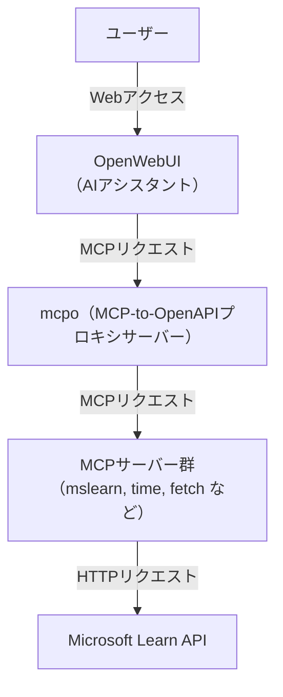
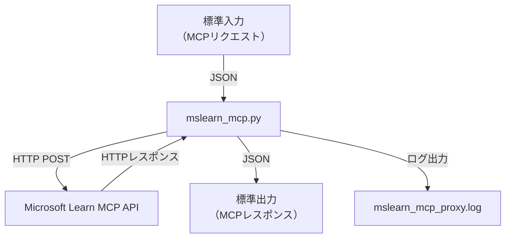

## はじめに

OpenWebUIは、ChatGPTのような対話型AIをブラウザから利用できるOSSです。
大きな特徴のひとつが **MCP（Model Context Protocol）** への対応で、これを利用することでAIが外部APIや独自ツールを自然に呼び出せるようになります。

本記事では、特に **Microsoft Learn MCP Server** をOpenWebUIに組み込む方法を、**Docker Compose** を使って初心者でも迷わないように解説します。

---

## 1. MCPとは？

MCP（Model Context Protocol）は、**AIと外部ツールをつなぐための共通プロトコル**です。
例えば：

* Microsoft Learnの公式ドキュメントを検索
* 現在時刻を取得
* 独自APIを呼び出す

といった処理を、AIから自然に利用できるようにします。

---

## 2. システム構成イメージ



**mcpo**は、Open WebUI と連携して動作する「MCP（Model Context Protocol）→ OpenAPI プロキシサーバー」です。
mcpo を使って MCP ツールを OpenAPI 化することで、Open WebUI 上からMCPを利用できるようにしています。


---

## 3. 必要な準備

* **Docker** と **Docker Compose** をインストール
* 作業用ディレクトリを作成し、以下のファイルを配置

```
.
├── docker-compose.yml
└── mcpo/
    ├── config.json
    ├── Dockerfile
    ├── requirements.txt
    └── mcpo-tools/
        └── mslearn_mcp.py
```

---

## 4. Docker Composeによるセットアップ

### 4.1. `docker-compose.yml`

```yaml
version: "3.9"

services:
  openwebui:
    image: ghcr.io/open-webui/open-webui:main
    ports:
      - "8080:8080"
    volumes:
      - open-webui:/app/backend/data
    extra_hosts:
      - "host.docker.internal:host-gateway"
    restart: always
    environment:
      PORT: "8080"
      # Open WebUI が接続する MCP エンドポイント（mcpo）
      OPENWEBUI_MCP_URL: "http://mcpo:8000"
    networks:
      - mcp-network
    depends_on:
      - mcpo

  mcpo:
    build: ./mcpo
    container_name: mcpo
    ports:
      - "8000:8000"
    restart: always
    networks:
      - mcp-network
    volumes:
      # 実運用では config.json はマウントして差し替えやすく
      - ./mcpo/config.json:/opt/mcpo/config.json:ro
      # （必要に応じ）ツール群もマウントで差し替え可
      - ./mcpo/mcp-tools:/opt/mcpo/mcp-tools:ro
    command: ["--config", "/opt/mcpo/config.json"]

volumes:
  open-webui:
    external: true

networks:
  mcp-network:
    driver: bridge
```

👉 `openwebui` と `mcpo` の2つのコンテナを立てます。

* `openwebui`: WebUI本体（ [http://localhost:8080](http://localhost:8080) ）
* `mcpo`: MCPサーバーをまとめて管理（ポート8000で待機）

---

### 4.2. MCPサーバーの設定（`mcpo/config.json`）

```json
{
  "mcpServers": {
    "mslearn": {
      "type": "stdio",
      "command": "/opt/mcpo/.venv/bin/python",
      "args": ["/opt/mcpo/mcp-tools/mslearn_mcp.py"]
    },
    "fetch": {
      "command": "uvx",
      "args": ["mcp-server-fetch"]
    }
  }
}
```

- `mslearn` サーバーを登録し、Microsoft Learn APIに接続できるようにします。

- ここでは、Webで公開されているfetch MCPサーバーも組み込んでいます。

---

## 5. MCP用Dockerfile

次に、`mcpo/Dockerfile` の中身を見てみましょう。

```dockerfile
FROM python:3.12-slim-bookworm

# Pythonのパッケージ管理ツール uv (from official binary) をインストール
COPY --from=ghcr.io/astral-sh/uv:latest /uv /uvx /bin/

# 必要なパッケージをインストール
RUN apt-get update && apt-get install -y --no-install-recommends \
    git \
    curl \
    ca-certificates \
    && rm -rf /var/lib/apt/lists/*

# 作業ディレクトリを /opt にし、GitHubからmcpoの最新版をクローン
WORKDIR /opt
RUN git clone --depth 1 https://github.com/open-webui/mcpo.git
WORKDIR /opt/mcpo

# 依存パッケージリストとconfig.jsonをコピー
COPY requirements.txt /opt/mcpo/
COPY config.json /opt/mcpo/

# 仮想環境作成と依存インストール
RUN uv venv /opt/mcpo/.venv
RUN uv pip install pip
RUN uv pip install . && rm -rf ~/.cache
RUN /opt/mcpo/.venv/bin/pip install -r /opt/mcpo/requirements.txt

# MCPツールを配置
COPY mcp-tools/ /opt/mcpo/mcp-tools/

# mcpoインストール確認
RUN /opt/mcpo/.venv/bin/mcpo --help

# ポート公開・起動設定
EXPOSE 8000

WORKDIR /opt/mcpo
ENV PYTHONPATH=/opt/mcpo
ENTRYPOINT ["/opt/mcpo/.venv/bin/mcpo"]
CMD ["--help"]
```

👉 ポイント

* `python:3.12-slim-bookworm` をベースに最小限の環境を構築
* 必要なLinuxツール（`git`, `curl` など）を追加
    * curlはデバッグ用としてインストール
* OpenWebUI公式の `mcpo` リポジトリをクローン
* `requirements.txt` と `config.json` をコピー

これで「独自のMCPサーバー」を含めた環境がDocker上に整います。

**image: u1and0/mcpoを利用すると、Python環境がうまくコンテナ内に構築できなかった、mcpoをGitHubからCloneして構築するようにしている。**

### requirements.txtは、requests だけを指定。


```
requests
```

別のパッケージも使うなら、requirements.txtに追記する。


---

## 6. Microsoft Learn MCPサーバー（`mslearn_mcp.py`）

Microsoft Learn APIと通信する中継役のPythonプログラムです。

**概要**

- 標準入力（stdin）で受け取ったリクエスト（JSON形式）を
- Microsoft LearnのMCPサーバー（https://learn.microsoft.com/api/mcp） にHTTPで転送し
- サーバーからのレスポンスを標準出力（stdout）にそのまま返す


```python
#!/usr/bin/env python3
import sys
import json
import requests

# Microsoft Learn MCP サーバーのエンドポイント
LEARN_MCP_URL = "https://learn.microsoft.com/api/mcp"

def send_to_learn_mcp(payload):
    """Microsoft Learn MCP サーバーにリクエストを転送"""
    response = requests.post(
        LEARN_MCP_URL,
        json=payload,
        headers={"Content-Type": "application/json"}
    )
    try:
        response.raise_for_status()
        # レスポンス内容をログに出力
        with open("/tmp/mslearn_mcp_proxy.log", "a", encoding="utf-8") as f:
            f.write(response.text + "\n")
        return response.json()
    except Exception as e:
        return {"error": str(e)}

def main():
    for line in sys.stdin:
        try:
            request = json.loads(line)
            response = send_to_learn_mcp(request)
            print(json.dumps(response), flush=True)
        except Exception as e:
            print(json.dumps({"error": str(e)}), flush=True)

if __name__ == "__main__":
    main()
```

👉 仕組み

1. メイン処理

- main() 関数がエントリーポイント
- 標準入力から1行ずつJSONリクエストを受け取る
- それを send_to_learn_mcp() でMicrosoft Learn MCPサーバーにPOST送信
- サーバーのレスポンスをそのまま標準出力に返す

2. サーバーへのリクエスト
- send_to_learn_mcp() 関数で
- 受け取ったJSONをAPIにPOST
- レスポンス内容やリクエスト内容を /tmp/mslearn_mcp_proxy.log に記録（ログ出力）
- レスポンスが「SSE形式（data: ...）」ならその部分だけ抽出してJSONとして返す
- それ以外は普通のJSONとして返す

3. エラー処理
- もしエラーが起きたら
- エラー内容やレスポンステキストをログに記録
- エラー情報をJSON形式で標準出力に返す(これは必要ないかも)

### イメージ図


---

## 7. 起動手順

1. ファイルを配置

2. ビルド & 起動

    ```bash
    docker compose up -d --build
    ```

## 8. Open WebUI側の設定

### 8.1 管理者パネルでツールに接続

1. 「設定」ー「ツール」を開く

2. ＋マークをクリック

3. 以下を入力  
    URL:`http:mcpo:8000/mslearn`  
    openapi.json URL or Path: `openapi.json`  
    名前: mcp.mslearn (任意)  
    Visibility: 公開

4. 保存ボタンをクリック

### 8.2 管理者パネルでモデルに紐づける

1. 「設定」ー「モデル」を開く   
    すでにモデルの設定は済んでいるものとする

2. MCPサーバーを有効にしたいモデルを選ぶ  
    モデルによっては、MCPに対応していないものもあるので注意  
    例えば、gpt-5-miniは非対応

3. 開いたページのツール欄で、Mcp.Mslearnにチェック

4. 「保存して更新」をクリック

### 8.3 チャット画面（利用者側）

1. チャット画面を開く

2. ＋ボタンをクリック

3. `mcp.mslearn`をONにする  
    8.2の設定をしていれば、ONになっているはず。

---

## 9. 利用例

OpenWebUIのチャット欄で

```
Azureの公式ドキュメントを検索して、Entra IDのユーザー管理についてまとめて
```

と入力すると、裏で `mslearn` MCPサーバーがMicrosoft Learn APIに問い合わせ、最新の公式情報を返してくれます。

---

## 10. 応用

* `mcpo/config.json` に他のツールを追加可能
* `mcpo/mcpo-tools/` にPythonスクリプトを置けば、社内APIや独自サービスも統合可能

---

## 11. まとめ

* MCPはAIに外部APIを使わせる仕組み
* Docker Composeで構築できる
* `mslearn_mcp.py` を使えばAIがMicrosoft Learn公式ドキュメントを直接参照可能
* 独自MCPサーバーを作れば、社内APIとも連携できる

---

### 参考リンク

* [OpenWebUI公式リポジトリ](https://github.com/open-webui/open-webui)
* [mcpo公式リポジトリ](https://github.com/open-webui/mcpo)
* [Microsoft Learn API](https://learn.microsoft.com/api/mcp)


