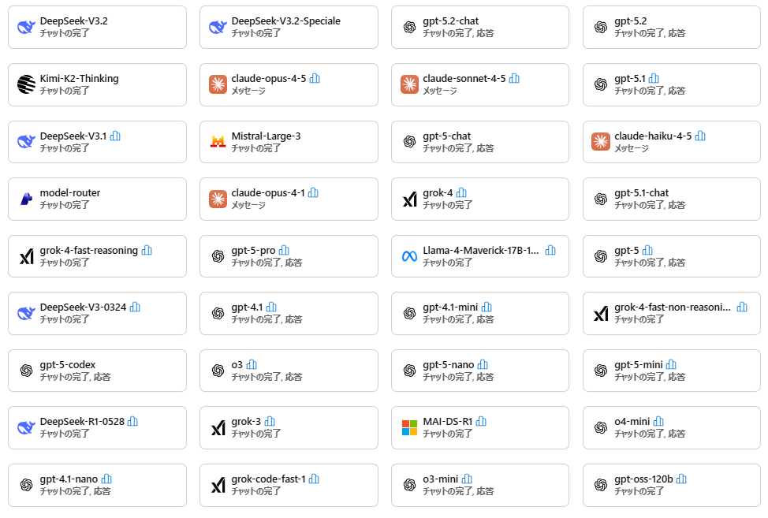

# Microsoft Foundry の生成AIモデルの利用は、学習に利用されるのか？

## はじめに

Microsoft Foundry（Azure AI Foundry / Foundry classic を含む）には、以下のように多数の生成 AI モデルがあります。

「Foundry でモデルを呼び出したとき、入力したデータ（プロンプトや添付データ）が外部に漏れる可能性は？」「学習に使われる可能性は？」という疑問は、性能や価格の前に確認しておきたいポイントです。

ポイントは単純で、Foundry のモデルは大きく **2 系統**に分かれ、**データの扱い（誰が処理するか／どこで処理され得るか／学習に使われるか）**の前提が違います。

---

## この記事の結論（先に要点だけ）

- **Azure Direct Models（Azure が直接提供するモデル）**は、Microsoft Learn に次が明記されています。  
  - **プロンプト/出力は、基盤モデルの学習・再学習・改善に使わない**（許可/指示がない限り）  
  - **モデルはステートレス**（モデル自体はプロンプト/出力を保持しない）  
  - **処理は原則として顧客が指定した “geography（地理）” の範囲**（ただし *Global / DataZone* などでは“処理され得る場所”が広がり得る）

  出典：Azure Direct Models のデータ・プライバシー  
  https://learn.microsoft.com/en-us/azure/ai-foundry/responsible-ai/openai/data-privacy?view=foundry-classic

- **Azure Direct Models ではないモデル（例：Foundry 経由の Claude）**は、Microsoft Learn に次が明記されています。  
  - **データ処理者は Anthropic（Microsoft ではない）**  
  - **プロンプト/出力は世界中で処理され得る**（運用目的で地域外を含む）

  出典：Claude models のデータ・プライバシー  
  https://learn.microsoft.com/en-us/azure/ai-foundry/responsible-ai/claude-models/data-privacy?view=foundry-classic

---

## この記事について

本記事は、手元メモ（中心：[`work/work05.txt`](work/work05.txt:1)）を土台にしつつ、Microsoft Learn の公式記述と照合して、**誤解が起きやすいポイント**を整理します。

特に混乱しがちなのが以下です。

- 「**どこで処理されるか**」＝ *リージョン固定？海外に出る？*
- 「**学習に使われるか**」＝ *モデル改善に回される？*

:::message
本記事は「法的助言」ではなく、Microsoft Learn の公開情報を読み違えないための整理です。最終判断は、契約条件・組織のポリシー・監査要件と合わせて行ってください。
:::

---

## まず押さえる：Foundry のモデルは 2 系統ある

Foundry のモデルは（雑に言うと）次の 2 系統に分類できます。**性能や価格より先に、この分類を確認するのが安全**です。

1. **Azure Direct Models（Azure が直接提供するモデル）**  
   例：Azure OpenAI の GPT 系など  
   - Microsoft Learn 公式：Azure Direct Models のデータ・プライバシー  
     https://learn.microsoft.com/en-us/azure/ai-foundry/responsible-ai/openai/data-privacy?view=foundry-classic

2. **Azure Direct Models ではないモデル（例：Foundry 経由の Claude / Anthropic）**  
   Foundry 上から使えても、**モデル提供者（例：Anthropic）がデータを処理**するタイプがあります。  
   - Microsoft Learn 公式：Claude models のデータ・プライバシー  
     https://learn.microsoft.com/en-us/azure/ai-foundry/responsible-ai/claude-models/data-privacy?view=foundry-classic

---

## 比較表：データ取り扱いの要点（公式記述ベース）

> この記事の比較の骨格は [`work/work05.txt`](work/work05.txt:1) の表です。  
> ただし、**“地域外処理なし”のような言い切り**は公式の書き方とズレやすいので、本文では公式表現に合わせています（後述の「訂正点」参照）。

| 見るポイント | Azure Direct Models（Azureが直接提供） | Foundry 経由のClaude（Anthropic） |
|---|---|---|
| 誰がプロンプト/出力を処理する？（データ処理者） | Microsoft（Azure） | Anthropic（Microsoftではない） |
| プロンプト/出力は“学習（モデル改善）”に使われる？ | Microsoft Learn で **「基盤モデルの学習・再学習・改善に使わない」**旨が明記（permission/instruction がない限り） | Microsoft Learn は **「学習に使わない」とは断言しない**。詳細は Anthropic のドキュメント参照の立て付け |
| どこで処理され得る？（処理場所） | 原則 **顧客指定の geography（地理）内**。ただし運用目的で geography 内の複数リージョン間で処理され得る。さらに **Global / DataZone** では“処理され得る場所”が広がり得る | Microsoft Learn で **「世界中で処理され得る（地域外含む）」**旨が明記（運用目的） |
| モデルは入力を覚える？（モデルへの保持） | **ステートレス**（モデル自体はプロンプト/出力を保存しない） | Microsoft Learn は、保存や有害コンテンツ対策などの詳細は Anthropic のドキュメント参照としている |
| Microsoft からモデル提供者に共有され得る情報 | プロンプト/出力は他顧客・モデル提供者・第三者へ提供されない旨を強調 | デプロイ時に **顧客連絡先情報や取引詳細（使用量含む）**をモデル提供者へ共有し得る旨の Note がある |
| 人間によるレビューはあり得る？ | 不正利用対策（abuse monitoring）で、フラグ時に人手レビューがあり得る旨の説明がある（Microsoft の承認済み担当者） | Claude 側の監視/レビューは Anthropic 文書参照の立て付け。Microsoft側の人手レビューを同じ粒度で断定しないのが安全 |

---

## 「どこで処理される？」をもう少し噛み砕く

初心者が混乱しやすいのが、「リージョン固定？」「海外に出る？」の部分です。ここは **“処理” と “保存” を分ける**のがコツです。

### 1) 処理（processing）：返答を作る計算が行われる場所

Azure Direct Models の公式説明は、ざっくり次のイメージです。

- 基本：**顧客が指定した Azure の “geography（地理）” の範囲で処理される**
- 例外（ただし公式が明記）：
  - 運用目的で **geography 内の別リージョン**で処理されることがある
  - **Global / DataZone** のデプロイ種別だと、**“処理され得る場所”がさらに広がる**ことがある

一方、Foundry 経由の Claude は、Microsoft Learn の時点で **「世界中で処理され得る」**注意書きがあります。

### 2) 保存（at rest）：履歴やアップロードデータが残る場所

Azure Direct Models でも、機能によってはデータが保存されます（例：Files API、vector store、Threads、Stored completions など）。  
この「保存」についても、公式ページで条件が説明されています。

> ここは重要なので、詳細は公式ページを参照するのが安全です。  
> https://learn.microsoft.com/en-us/azure/ai-foundry/responsible-ai/openai/data-privacy?view=foundry-classic

---

## “学習に使われない”の強さ：Azure Direct は明確、Claude は「契約/ドキュメント依存」

### Azure Direct Models：非学習が明確に書かれている

Azure Direct Models の公式ページは、重要事項として次を **箇条書きで強く明示**しています。

- 他顧客・プロバイダー・第三者へ提供しない
- 基盤モデルの学習・再学習・改善に使わない（許可/指示がない限り）
- モデルはステートレス

（出典）  
https://learn.microsoft.com/en-us/azure/ai-foundry/responsible-ai/openai/data-privacy?view=foundry-classic

### Claude（Foundry経由）：Microsoft Learn は Anthropic 文書へ委ねる

Claude 向けページは、処理者が Anthropic である点と処理場所の注意を強調しつつ、**「保存やスクリーニング等は Anthropic のドキュメントを見てください」**という案内です。

（出典）  
https://learn.microsoft.com/en-us/azure/ai-foundry/responsible-ai/claude-models/data-privacy?view=foundry-classic

つまり、**“Azure Direct と同じ強さで学習利用しない保証がある”と読み替えるのは危険**です。

---

## どちらを選ぶべきか：まずは「データの前提」で決める

モデル選びは性能比較に目が行きがちですが、企業利用ではまず **「データの前提が社内ルールに合うか」** を先に確認するのが安全です。

### Azure Direct Models が向くケース（説明責任・監査を重視）

- 社内/顧客データを扱い、**「学習に使われない」などの説明を根拠付きで示したい**
- 監査や規制対応で、**Microsoft（Azure）の枠組みに寄せたい**
- 「どこで処理され得るか」を **デプロイ種別（Global / DataZone など）**と **geography（地理）**の観点で設計したい

### Claude（Foundry経由）が向くケース（Claude を使う理由が明確）

- Claude 固有の性能・機能を使いたい（長文、特定の生成特性など）
- そのうえで、**データ処理者が Anthropic であること**と、Microsoft Learn にある **「世界中で処理され得る」**注意書きが、組織ポリシーと矛盾しない

---

## 「このモデルは Azure Direct Models なの？」を確かめる方法

メモ（[`work/work03.txt`](work/work03.txt:1), [`work/work06.txt`](work/work06.txt:1)）の趣旨は概ね妥当で、公式の考え方としては次が使えます。

- Foundry のモデルカタログで **“Direct from Azure”** 相当の絞り込み（UI/仕様は変更される可能性あり）
- 公式ドキュメントで **“sold directly by Azure”** に該当するか確認  
  例：  
  https://learn.microsoft.com/en-us/azure/ai-foundry/foundry-models/concepts/models-sold-directly-by-azure?view=foundry-classic

### 参考：代表的な Azure Direct Models

- OpenAI 系：gpt‑5.2, gpt‑5.2‑chat、 gpt‑5.1‑codex、 DALL·E など
- xAI：grok‑code‑fast‑1、 grok‑4 など
- Meta：Llama‑4‑Maverick‑17B‑128E‑Instruct‑FP8 など
- DeepSeek：DeepSeek‑V3.2、 DeepSeek‑V3.1 など
- Microsoft：Phi-4, Phi-3、 MAI-DS-R1 など

---

## 訂正点（元メモとの差分）

以下は、元メモ（主に [`work/work05.txt`](work/work05.txt:1) と補助の [`work/work01.txt`](work/work01.txt:1)）を **Microsoft Learn の公式記述に合わせて補正**した点です。

1. **「地域外処理なし（リージョン固定）」という言い切りを修正**  
   - 元メモの趣旨：Azure Direct Models は「地域外処理なし」と読める表現（例：[`work/work05.txt`](work/work05.txt:31), [`work/work05.txt`](work/work05.txt:32)）  
   - 公式に合わせた表現：  
     - 原則は「顧客指定 geography 内で処理」  
     - ただし「運用目的で geography 内の複数リージョン間で処理され得る」  
     - さらに「Global / DataZone のデプロイ種別では処理場所が広がり得る」  
   - 根拠（公式）：  
     https://learn.microsoft.com/en-us/azure/ai-foundry/responsible-ai/openai/data-privacy?view=foundry-classic

2. **Claude（Foundry経由）の処理主体を“Microsoftではない”と明確化**  
   - 元メモの趣旨：概ね正しいが、引用が不完全（`turn...` のような内部参照が残っている）  
   - 公式に合わせた表現：  
     - 「Anthropic（not Microsoft）がデータ処理者」  
     - 「prompts and outputs may be processed anywhere in the world」  
   - 根拠（公式）：  
     https://learn.microsoft.com/en-us/azure/ai-foundry/responsible-ai/claude-models/data-privacy?view=foundry-classic

3. **比較表に残っていた非公式の引用表記（citeturn...）を全て除去**  
   - ブログ記事では、上記の Microsoft Learn URL へ置き換えました。

---

## 参考リンク（公式）

- Azure Direct Models のデータ・プライバシー：  
  https://learn.microsoft.com/en-us/azure/ai-foundry/responsible-ai/openai/data-privacy?view=foundry-classic
- Claude models in Microsoft Foundry のデータ・プライバシー：  
  https://learn.microsoft.com/en-us/azure/ai-foundry/responsible-ai/claude-models/data-privacy?view=foundry-classic
- Models sold directly by Azure（Azure Direct の見分け方の一助）：  
  https://learn.microsoft.com/en-us/azure/ai-foundry/foundry-models/concepts/models-sold-directly-by-azure?view=foundry-classic

## 最後に

Foundry で生成 AI を使うときは、まず **「Azure Direct Models かどうか」**でデータ取り扱いの前提が分かれます。  
迷ったら、Microsoft Learn の **データ・プライバシー**ページ（上記リンク）を“根拠”として押さえてから、組織の要件に合うモデルを選ぶのが安全です。