Pythonをインストール


2. Pythonをインストール
Pythonがインストールされていない場合、以下の手順でインストールします。

2.1 ダウンロード
Python公式サイトにアクセスし、最新のPythonをダウンロードします。
https://www.python.org/downloads/

2.2 インストール時の注意点
インストール画面で**「Add Python to PATH」**にチェックを入れます。
「Customize installation」を選択し、以下を確認してインストール：
pipが含まれていることを確認。
Pythonランチャーのインストールを有効化。

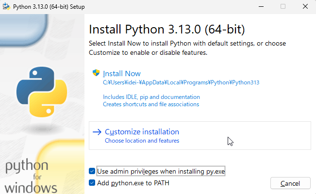

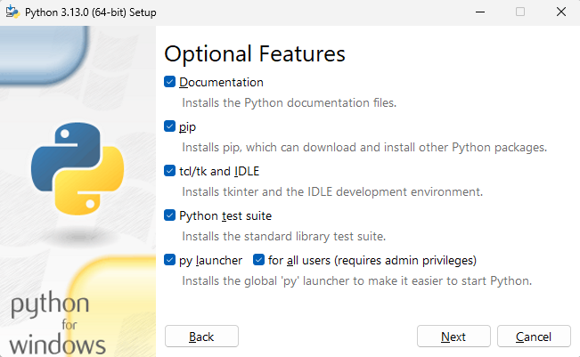

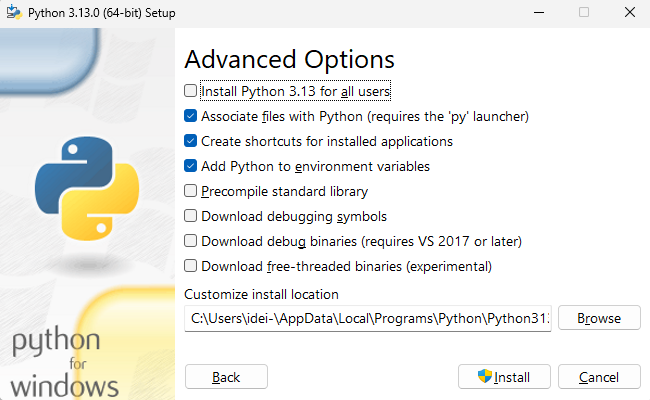

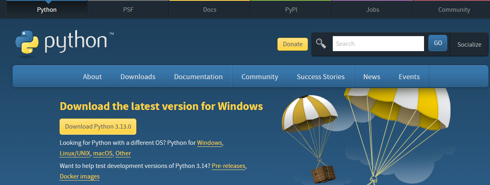

pip install notebook

dotnet tool install -g Microsoft.dotnet-interactive

dotnet interactive jupyter install

jupyter kernelspec list
で確認

VS Codeを起動し、以下の拡張機能をインストール

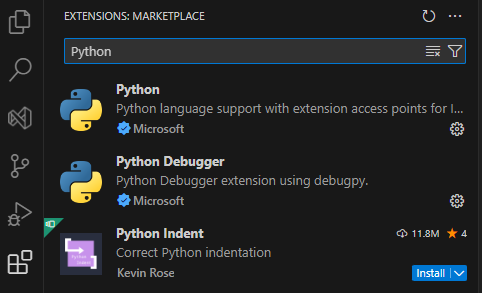

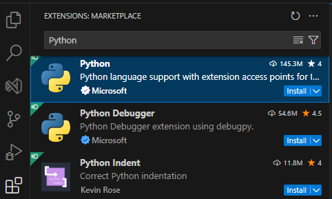
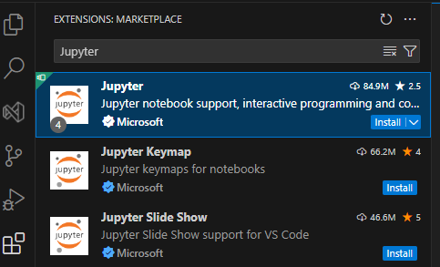


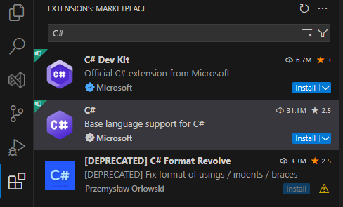


1. .ipynbファイルを作成または開く
VS Codeで新しいファイルを作成し、拡張子を.ipynbにします。
例: example.ipynb

Select Kernelをクリック
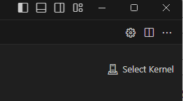


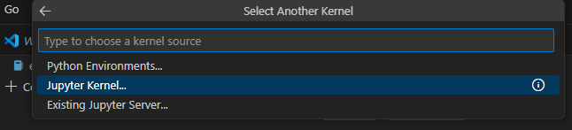

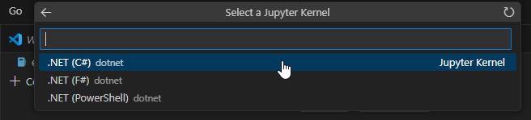


Polyglot Notebooksは、複数のプログラミング言語を1つのノートブック内でシームレスに使用できるツールです。主にJupyter Notebookを拡張した形式で、特に.NET Interactiveを活用することでC#、F#、PowerShell、Python、SQLなどを切り替えて利用可能です。各言語ごとにセルを分けて記述でき、データの共有や連携も簡単に行えます。Visual Studio Codeと統合されており、データ解析やスクリプト作成、マルチプラットフォーム開発に適しています。
.NET SDK をインストール

https://dotnet.microsoft.com/ja-jp/download/dotnet

.NET8 ,NET9のどちらでも

.NET interactiveqをインストール

```
dotnet tool install -g Microsoft.dotnet-interactive
```

Visual Studio Codeを起動し、Polyglot Notebooks をインストール

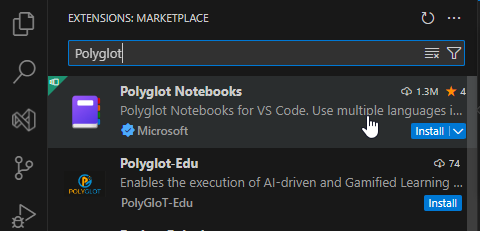

フォルダを作成し、そのフォルダをVS Codeで開く。

Ctrl+Alt+Window+Nをタイプ

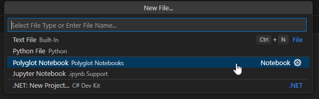    
.dibを3択します。

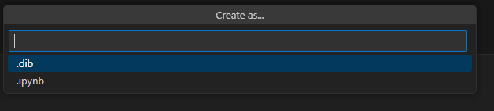

dibファイルとipynbファイルの違いは以下の通りです。

#### 1. .dib（.NET Interactive Notebook）

- Polyglot Notebooks独自のファイル形式です。
- 軽量なMarkdown形式に基づいており、セルごとにコードやテキストを記述します。
- 言語ごとに異なるカーネル（例: C#、Python、F#など）を使用できます。
- Gitに保存する場合に適している..dibファイルは、通常のMarkdown形式に近いため、差分管理が容易です。


#### 2. .ipynb（Jupyter Notebook）

- Jupyter Notebookの標準形式です。
- JSON形式でデータを保存するため、ファイルサイズがやや大きくなります。
- Jupyterカーネルで動作しますが、Polyglot Notebooksもこの形式をサポートします。
- Jupyter Notebook、JupyterLab、Google Colabなど、他のツールでも開くことができます。

言語を選択します。ここではC#を選びます。


ファイルが作成されます。適当な名前で保存しておきます。

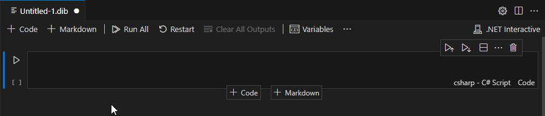

コードを入力する欄がありますので、ここにC#のコードを入力します。
ここでは今のコードを入力。

```cs
var a = 10;
var b = 20;
Console.WriteLine($"Sum: {a + b}");
```

コード入力欄の左にある▷マークをクリックするとコードを実行できます。

以下、実行した結果です。

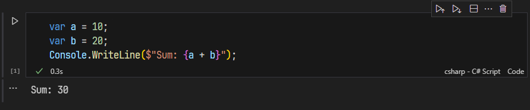

別のコードを実行したい場合は、上部の 「＋Code」をクリックします。
先ほどの下に新たなコード入力欄が現れます。

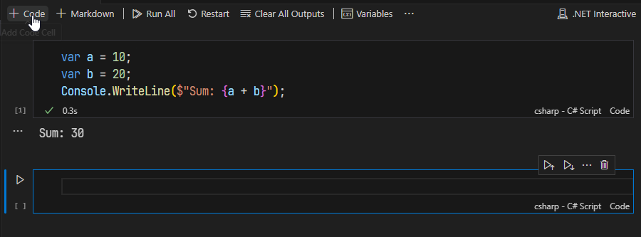

ここにコードを入れて、同様に左にある▷マークをクリックするとコードを実行できます。

全てのコードを実行したい場合は、上部の「Run All」をクリックします。

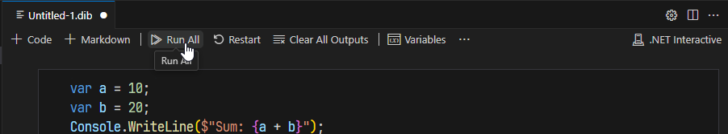

## markdownを記入する

コード欄以外にカーソルを移動すると、Markdownを追加するボタンが現れます。

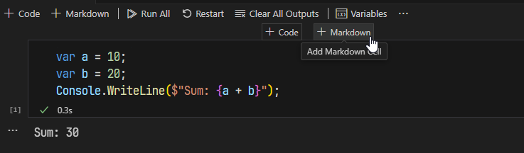

このボタンをクリックするとMarkdownを記入できる欄が追加されますので、ここで、コードの説明文などを記入します。

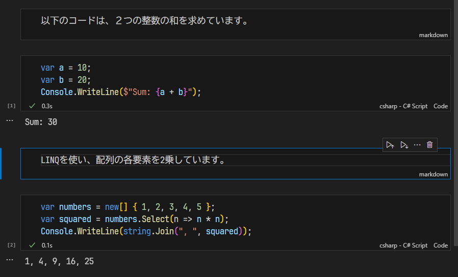

C#の動作をちょっと確認したい時とか、教育用に利用できそうですね。
